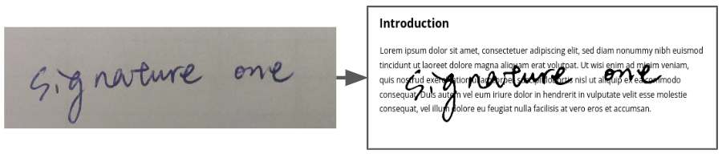

# transparent-signature-maker
Generate transparent-background signature in GIF format from signature photo.

__Keywords__: signature, gif, transparent background

## Introduction

A light weight tool to create transparent-background signature in GIF format from input photo. The signature can be further used in document such as Google Doc or Word. Below is an example result.


## Requirements

In Python 3.X envrionment, install reqirements by `pip install -r requirements.txt`

## Usage

Put the signature photo to `./files` folder, and `python main.py -h` to check arguments meaning.

The [example](./files/signature1.gif) is generated by the command: 
```
python main.py -i signature1.jpg -g 130
```